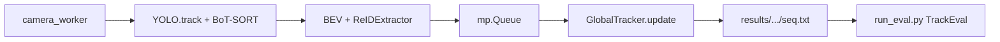

# Analiza I/O i konfiguracja kalibracji

## KROK 1 — Odpowiedzi na pytania o spójność I/O

### 1. Format detektor → tracker

**W pamięci, klatka po klatce** — nie ma pośrednich plików detekcji.

Warstwa lokalna: Ultralytics `YOLO.track(...)` zwraca `Results` z boxami jako tensorami; w [`system/main.py`](system/main.py) konwersja do numpy `xyxy` `(N, 4)`. Confidence i class są w `boxes.conf` / `boxes.cls`, ale **nie są przekazywane dalej** (tylko filtr `conf=0.25` i `classes=[0]` przy wywołaniu).

Po wzbogaceniu w `camera_worker` każda detekcja to słownik:

```python
{"bev": (bx, by), "reid": np.ndarray(1, 768), "box": (x1, y1, x2, y2)}
```

Pakiet przez `multiprocessing.Queue`:

```python
{"camera_id": int, "frame_idx": int, "detections": [ ... ]}
```

### 2. Ujednolicony interfejs trackerów?

**Nie w pełni.** Są dwie warstwy bez wspólnej abstrakcji:

| Warstwa                | Interfejs                                                        | Wejście                                |
| ---------------------- | ---------------------------------------------------------------- | -------------------------------------- |
| Lokalny SCT (BoT-SORT) | `model.track(frame, tracker="configs/custom_botsort.yaml", ...)` | klatka + YAML Ultralytics              |
| Globalny MCT           | `GlobalTracker.update(current_detections)`                       | `list[dict]` z `reid`, `bev` (+ `box`) |

Tylko [`system/src/global_tracker.py`](system/src/global_tracker.py) ma klasyczny `.update(detections)`. Skrypty [`tracker_local.py`](system/src/tracker_local.py), [`tracker_bev.py`](system/src/tracker_bev.py), [`pom_fusion.py`](system/src/pom_fusion.py) to osobne demo bez tego API.

### 3. Format MOT Challenge?

**Tak** — zapis wyłącznie w [`system/main.py`](system/main.py) (ok. linii 136–144):

```text
frame,id,x,y,w,h,1,-1,-1,-1
```

Plik: `results/MGR_Tracker/data/{seq_name}.txt`. Ewaluacja: [`system/run_eval.py`](system/run_eval.py) → TrackEval.

Uwaga: lokalne ID BoT-SORT są sprawdzane (`boxes.id is not None`), ale **nie trafiają** do `GlobalTracker` — do MOT idą tylko `global_id`.



---

## KROK 2 — Parametryzacja (wybrane podejście)

**Jeden plik** [`system/configs/experiment.yaml`](system/configs/experiment.yaml) jako źródło prawdy dla kalibracji. Istniejący [`system/configs/custom_botsort.yaml`](system/configs/custom_botsort.yaml) zostaje, ale jego wartości będą **generowane / nadpisywane** z `experiment.yaml` (albo ścieżka do YAML BoT-SORT będzie wskazywana z configu), żeby nie dublować progów w trzech miejscach (`main.py` conf 0.25 vs `tracker_local` 0.2 vs YAML).

### Proponowana struktura `experiment.yaml`

```yaml
detection:
  model: yolov8m.pt
  conf: 0.25 # próg YOLO przed trackerem
  iou: 0.5 # NMS (dziś tylko w tracker_local)
  classes: [0]

botsort: # mapuje 1:1 na custom_botsort.yaml
  track_high_thresh: 0.25 # I faza asocjacji (wysoka conf)
  track_low_thresh: 0.1 # II faza (niska conf)
  new_track_thresh: 0.3
  track_buffer: 60 # czas życia / max_age lokalny
  match_thresh: 0.8 # próg dopasowania IoU-like
  proximity_thresh: 0.5 # IoU / bliskość przestrzenna
  appearance_thresh: 0.25 # Re-ID lokalny BoT-SORT
  with_reid: true
  gmc_method: sparseOptFlow
  fuse_score: true

global_tracker:
  max_visual_cost: 0.4 # próg cosinusowy Re-ID (dziś w ctor)
  max_spatial_dist: 150.0 # bramka BEV w px (main: 150, default klasy: 100)
  max_missed_frames: 300 # dziś hardcoded w update()
  # opcjonalnie później: alpha/beta fuzji kosztu

reid:
  model_name: google/vit-base-patch16-224-in21k
  min_crop_size: 10

experiment:
  seq_name: MOT17-02-FRCNN
  tracker_name: MGR_Tracker
  video_pattern: "data/MOT17/train/{seq_name}/img1/%06d.jpg"
  homography: data/calibration/homography.npy
  bev_size: [500, 500]
```

### Mapowanie „kluczowych zmiennych” z zapytania

| Co chcesz kalibrować                    | Gdzie jest dziś                                                  | Klucz w configu                                                                     |
| --------------------------------------- | ---------------------------------------------------------------- | ----------------------------------------------------------------------------------- |
| Detection threshold I/II fazy asocjacji | `track_high_thresh` / `track_low_thresh` w BoT-SORT YAML         | `botsort.track_high_thresh`, `botsort.track_low_thresh` (+ osobno `detection.conf`) |
| Track buffer / max_age                  | `track_buffer: 60` (lokalnie); `missed_frames > 300` (globalnie) | `botsort.track_buffer`, `global_tracker.max_missed_frames`                          |
| IoU / proximity                         | `match_thresh`, `proximity_thresh`                               | `botsort.match_thresh`, `botsort.proximity_thresh`                                  |
| Re-ID appearance                        | `appearance_thresh` (lokalnie); `max_visual_cost` (globalnie)    | `botsort.appearance_thresh`, `global_tracker.max_visual_cost`                       |
| Bramka przestrzenna BEV                 | `max_spatial_dist`                                               | `global_tracker.max_spatial_dist`                                                   |

---

## Refaktoryzacja (bez pisania od zera)

1. **Dodać** `system/configs/experiment.yaml` + mały loader (np. `system/src/config.py`: `load_config(path) -> dict`, zapis tymczasowego `botsort` YAML z sekcji `botsort`).
2. **Podpiąć** [`main.py`](system/main.py): `conf`/`classes`/ścieżki sekwencji z configu; `GlobalTracker(...)` z `max_visual_cost`, `max_spatial_dist`; ścieżka trackera YAML z configu.
3. **Rozszerzyć** [`GlobalTracker.__init__`](system/src/global_tracker.py) o `max_missed_frames` (zamiast literału `300`).
4. **Ujednolicić** wywołania `conf` w skryptach pomocniczych dopiero jeśli będą używane w eksperymentach (opcjonalnie w tym samym etapie: `tracker_local.py`).
5. **Nie zmieniać** kontraktu I/O (`list[dict]` + MOT write) — tylko źródło progów.

### Świadome niespójności do naprawienia przy okazji

- `conf`: 0.25 w `main.py` vs 0.2 w pozostałych skryptach → jedna wartość z configu.
- `max_spatial_dist`: default klasy 100, w `main` 150 → tylko wartość z configu.
- `max_missed_frames=300` nie jest parametrem konstruktora.
- Docstring `update` wspomina `camera_id` per detekcję — nie jest przekazywany; nie blokuje działania, można zostawić lub dodać później.

### Poza zakresem tego kroku

Pełny harness multi-run (siatka hiperparametrów, wiele sekwencji) — naturalny następny krok po działającym `experiment.yaml` + jednym przebiegu `main` → `run_eval`.
